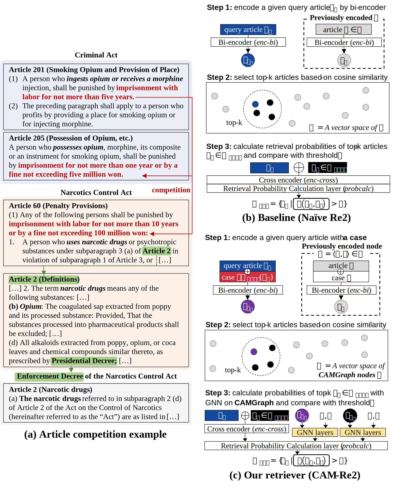

# Legal Article Competition Detection (LACD)

An official repository for *A Method for Detecting Legal Article Competition for Korean Criminal Law Using a Case-augmented Mention Graph* paper.



## Installation

### **Virtual environment**

```bash
conda create -n lacd python=3.9
conda activate lacd
pip install -r requirements.txt
```

Before you start, make sure your default python execution path is our base directory. You can change it by `export PYTHONPATH=.`

<!-- ### **Chroma DB**

```bash
pip install chromadb
pip install chromadb-client
``` -->

### **Law download**

Please locate provided `/data/database` folder in `/data/database`.
You can download it in `https://drive.google.com/file/d/1TcXfcGUlww9w6quWaSon3RYxqt_Q1Od9/view?usp=sharing`.

### **Setting SEED value**

You can change the seed value by changing following codes in `/src/utils/utils.py` file.

```python
SEED = 42

def article_key_function(text)->str:
    import re
    #...
```

## Train

### Bi-encoder train

```bash
# Naïve Re2 bi-encoder
python ./src/encoders/bi_encoder/train/finetune.py --model monologg/kobigbird-bert-base --mode train --tag kbb-baseline

# Ours
python ./src/encoders/bi_encoder/train/finetune.py --model monologg/kobigbird-bert-base --mode train --tag kbb-caseaug --method case-augmentation
```

The models are saved in `/data/models/LACD-bi`. 
<!-- Alternatively, you can use provided model checkpoints. -->

### Build Chroma DB from scratch

By executing following codes, Chroma DBs are automatically built.

```bash
# Naïve Re2 bi-encoder chroma DB (kbb-baseline)
python ./src/main.py --biencoder_model_path ./data/models/LACD-bi/kbb-baseline --chroma_db_name kbb-baseline --biencoder_method baseline --retrieval_method bi-only

# Ours bi-encoder chroma DB (kbb-caseaug)
python ./src/main.py --biencoder_model_path ./data/models/LACD-bi/kbb-caseaug --chroma_db_name kbb-caseaug --biencoder_method caseaug --retrieval_method bi-only
```

Chroma DBs are saved in `/data/database/chroma_db`. Note that it takes amount of time. Alternatively, you can use provided Chroma DB file.

### Cross encoder train (Experiments for Step 3)

```bash
# Naïve Re2 cross-encoder
python ./src/main.py --biencoder_model_path ./data/models/LACD-bi/kbb-baseline --chroma_db_name kbb-baseline --biencoder_method baseline --retrieval_method bi-only

# Ours
python ./src/methods/LawGNN/train/crossencoder_finetune.py --tag kbb-baseline-gat-caseaugembds --gnn_method gat --chroma_db_name kbb-caseaug --case_augmentation_method baseline --epoch 3
```

Without `--model` option, our code trains `monologg/kobigbird-bert-base` (KoBigBird) model. After training, the models are saved in `/data/models/LACD-cross`. 
<!-- Alternatively, you can use provided model checkpoints -->

Alternatively, you can use the following code.
```bash
bash bash-files/cross-encoder/cross_train_seedset.sh
```


## Inference

### Retrieve competing articles (Experiments for all Steps)

You can check the retrieval result by following code

```bash
# Naïve Re2 retriever
python ./src/main.py --crossencoder_model_path ./data/models/LACD-cross/qwen2-0.5-baseline --biencoder_model_path ./data/models/LACD-bi/kbb-baseline  --chroma_db_name kbb-baseline --retrieval_method hybrid --crossencoder_index_method none --crossencoder_method baseline --biencoder_method baseline

# CAM-Re2
python ./src/main.py --crossencoder_model_path ./data/models/LACD-cross/gnns/kbb-baseline-gat-caseaugembds --biencoder_model_path ./data/models/LACD-bi/kbb-caseaug  --chroma_db_name kbb-caseaug --retrieval_method hybrid --crossencoder_index_method gat --crossencoder_method baseline --biencoder_method caseaug
```

### Testing query processing time

You can check query processing time (One of Appendix experiments) by following code.

```bash
bash ./bash-files/retrieval/qps-test.sh
```

## Ablation studies


### Step 3 experiment without cross encoder

You can check CAM-Re2 without cross encoder by following code.
```bash
bash bash-files/cross-encoder/noLM-crossencoder_train.sh
```


### GNN architectures comparison

You can check alternative GNN architectures (GCN and GraphSAGE) for CAM-Re2 by following code.

```bash
python ./src/methods/LawGNN/train/crossencoder_finetune.py --tag kbb-baseline-gcn-caseaugembds --gnn_method gcn --chroma_db_name kbb-caseaug --case_augmentation_method baseline --epoch 3


python ./src/methods/LawGNN/train/crossencoder_finetune.py --tag kbb-baseline-graphsage-caseaugembds --gnn_method graphsage --chroma_db_name kbb-caseaug --case_augmentation_method baseline --epoch 3
```
